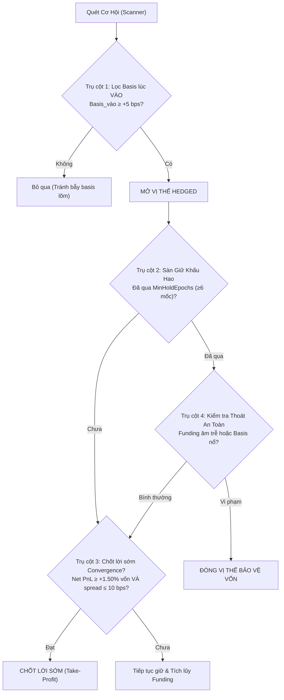

# Chiến lược Hội tụ Basis & Khấu hao Phí trong Arbitrage Cash & Carry
*(Basis Convergence & Fee Amortization Strategy for Hedged Arbitrage)*

**Tài liệu tham chiếu:** [BINANCE-AUTO-BOT-PLAN.md](file:///Users/mtls/Project/crypto-futures-arbitrage-scanner/docs/BINANCE-AUTO-BOT-PLAN.md)  
**Báo cáo định lượng:** [docs/reports/autotrade-params-2026-09-16.html](file:///Users/mtls/Project/crypto-futures-arbitrage-scanner/docs/reports/autotrade-params-2026-09-16.html)  
**Ngày ban hành:** 2026-09-16

---

## 1. Tôn chỉ & Nguyên lý Kinh tế Cốt lõi

Arbitrage Cash & Carry là chiến lược khai thác **chênh lệch cấu trúc (Structural Arbitrage)** giữa thị trường Spot và Hợp đồng Tương lai Không kỳ hạn (Perp). Chiến lược này **không phải giao dịch lướt sóng tần suất cao (HFT)**.

### 1.1. Bản chất Chi phí Ma sát Ban đầu (Friction Cost Deficit)
Ngay tại thời điểm khớp một vị thế hedged (Long Spot + Short Perp), tài khoản **mặc định rơi vào trạng thái âm trước**:
$$\text{Chi phí ma sát} = \text{Phí vào} + \text{Phí ra dự kiến} + \text{Trượt giá 2 chiều} \approx 25 - 35\text{ bps (mainnet)}, \sim 8\text{ bps (testnet)}$$

> [!IMPORTANT]
> **Đóng lệnh sớm = Chủ động hiện thực hóa khoản lỗ.**  
> Nếu một vị thế bị đóng chỉ sau vài phút hay vài giờ do nhiễu sổ lệnh hoặc vì một mốc settle âm nhỏ ($-0,1\text{ bps}$), bot sẽ mất trọn vẹn 30 bps tiền phí để tránh một khoản âm chỉ bằng 1/300 chi phí thoát.

### 1.2. Hai Dòng Tiền Tạo Lợi Nhuận của Chiến lược
Lợi nhuận ròng của một vị thế hedged được hình thành từ 2 nguồn độc lập:
$$\text{Net PnL} = \underbrace{\sum_{i=1}^{N} \text{Funding}_i}_{\text{Dòng 1: Thu nhập Funding}} - \underbrace{\text{Tổng phí \& trượt giá}}_{\text{Chi phí ma sát}} + \underbrace{(\text{Basis}_{\text{vào}} - \text{Basis}_{\text{ra}})}_{\text{Dòng 2: Lãi hội tụ giá (Convergence)}}$$

Trong đó:
$$\text{Basis} = \frac{\text{Mid}_{\text{Perp}} - \text{Mid}_{\text{Spot}}}{\text{Mid}_{\text{Spot}}} \times 10.000\text{ bps}$$

- **Dòng 1 (Funding)**: Cần thời gian tích lũy để bù đắp chi phí ma sát (thường từ 20 đến 80 mốc settle).
- **Dòng 2 (Hội tụ Basis)**: Nếu ta **vào lệnh lúc Perp đắt hơn Spot** ($\text{Basis}_{\text{vào}} > 0$) và **đóng lệnh khi khoảng cách giá co lại** ($\text{Basis}_{\text{ra}} \to 0$ hoặc âm), ta thu thêm một khoản lãi trôi giá lớn, có thể trả hết toàn bộ chi phí phí giao dịch mà không cần chờ đợi funding dài ngày.

---

## 2. Bốn Trụ Cột Kỹ Thuật của Chiến Lược Mới

### Trụ cột 1: Bộ Lọc Chất Lượng Basis lúc Vào (Entry Basis Quality Filter)
- **Vấn đề cũ**: Bot vào lệnh bất kể basis đang ở đâu, chỉ nhìn Net APR. Nhiều lần bot vào đúng đáy basis (ví dụ $-38\text{ bps}$ trên NEAR, $-1,5\text{ bps}$ trên ETH), khi sổ lệnh hồi phục về bình thường thì bị quét stop-loss sau vài chục giây.
- **Quy tắc mới**:
  - Chỉ cho phép mở vị thế khi:
    $$\text{Basis}_{\text{vào}} \ge \text{MinEntryBasisBps} \quad (\text{Mặc định: } +5,0\text{ bps trên testnet}, +10,0\text{ bps trên mainnet})$$
  - Đảm bảo ta luôn mua Spot ở vùng giá chiết khấu so với Perp.

### Trụ cột 2: Sàn Giữ Khấu Hao Phí (Fee Amortization Floor)
- **Vấn đề cũ**: Cắt lệnh ở mốc settle đầu tiên có rate $\le 0$.
- **Quy tắc mới**:
  - Thiết lập tham số `MinHoldEpochs` (Mặc định: **6 mốc settle** $\approx 48\text{ giờ}$).
  - Trong thời gian ân hạn này, **CẤM** bot tự ý thoát vì funding âm thông thường.
  - Vị thế được bảo vệ tuyệt đối để tích lũy funding và ổn định qua các mốc nhiễu.

### Trụ cột 3: Chốt Lời Sớm khi Hội Tụ Basis (Take-Profit on Convergence)
- **Cơ chế**:
  - Tại mỗi chu kỳ quét, engine tính toán PnL tạm tính theo giá khớp thực tế:
    $$\text{CashResultQuote} = \text{Funding đã nhận} - \text{Phí vào} - \text{Phí ra ước tính} + \text{Trôi giá hiện tại}$$
    $$\text{NetReturnOnCapitalPct} = \frac{\text{CashResultQuote}}{\text{Vốn cam kết}} \times 100\%$$
  - **Điều kiện Chốt Lời Chủ Động**:
    $$\text{NetReturnOnCapitalPct} \ge \text{TargetTakeProfitNetPct} \quad (\text{Mặc định: } +1,50\% \text{ trên vốn})$$
  - **Ý nghĩa**: Nếu basis co hẹp mạnh chỉ sau 2-3 ngày đem lại lợi nhuận ròng vượt chỉ tiêu, bot chốt lời ngay lập tức để quay vòng vốn sang cặp khác, không cần giam vốn đủ 30 ngày.
  - **Van chặn trượt giá theo spread (`MaxExitSpreadBps`, 4.5i)**: khi đã đạt ngưỡng, engine đo độ rộng chạm của CẢ HAI sổ lệnh:
    $$\text{SpreadBps} = \frac{\text{BestAsk} - \text{BestBid}}{\text{Mid}} \times 10^4$$
    Nếu spread của Spot **hoặc** Perp vượt `MaxExitSpreadBps`, lệnh đóng bị **HOÃN một chu kỳ quét** (10 giây) để đợi market maker đặt lại lệnh, thay vì quét Market vào một sổ đã rỗng. Vị thế không thay đổi gì trong lúc chờ; lượt quét sau định giá lại từ đầu và đóng ngay khi sổ co hẹp.
    - **Ranh giới**: van này **CHỈ** hoãn chốt lời. Cắt lỗ doãng basis, thoát funding âm trễ, `Stop & Close` và `Kill` **không bao giờ** bị chặn — hoãn một lối thoát rủi ro là cách một khoản lỗ nhỏ trở thành lớn.
    - **Vì sao ngưỡng 10 bps**: chạm đo được trên các cặp lớn ~1 bps, nên 10 bps chỉ chạm tới khi maker thực sự rút lệnh; còn khoản lãi đang được bảo vệ là $\approx 150\text{ bps}$ trên notional, lớn hơn hai bậc.
    - **Lưu ý định lượng**: `priceHolding` đã tính một phần chi phí spread qua `strategy.EstimateFill` (sổ giãn ⇒ phí đóng ước tính cao hơn ⇒ Net PnL tụt). Van này là lớp phòng vệ THỨ HAI trên nền đó, không phải lớp duy nhất.

### Trụ cột 4: Van Thoát Hiểm & Bảo Vệ Vốn (Safety Stop-Loss)
Vị thế chỉ bị buộc đóng trước hạn khi rơi vào các tình huống rủi ro thực sự:
1. **Thoát âm có trễ (Hysteresis Exit)**: Sau khi đã qua sàn `MinHoldEpochs`, nếu funding rate $\le -2,0\text{ bps}$ VÀ duy trì $\ge 2$ mốc liên tiếp.
2. **Basis gãy cấu trúc (Extreme Basis Blowout)**: Nếu basis doãng rộng bất thường $\text{Basis}_{\text{hiện tại}} - \text{Basis}_{\text{vào}} > 100\text{ bps}$ (`MaxBasisWidenBps`).
3. **Can thiệp khẩn cấp**: Người vận hành ra lệnh `Stop & Close`, `Kill`, hoặc đóng thủ công.

---

## 3. Bảng Tham Số Tiêu Chuẩn

| Tham số | Ý nghĩa | Testnet | Mainnet Khuyến nghị |
| :--- | :--- | :--- | :--- |
| `MinEntryBasisBps` | Ngưỡng basis tối thiểu lúc vào lệnh | $+5,0\text{ bps}$ | $+10,0\text{ bps}$ |
| `MinHoldEpochs` | Sàn giữ tối thiểu để khấu hao phí | $6\text{ mốc (48h)}$ | $6\text{ mốc (48h)}$ |
| `TargetTakeProfitNetPct` | Ngưỡng chốt lời sớm khi basis hội tụ | $+1,50\%$ trên vốn | $+1,50\%$ trên vốn |
| `MaxExitSpreadBps` | Trần spread cho phép GỬI lệnh chốt lời | $10,0\text{ bps}$ | $10,0\text{ bps}$ |
| `MaxBasisWidenBps` | Cắt lỗ do doãng basis cực đoan | $100\text{ bps}$ | $100\text{ bps}$ |
| `ExitNegativeFundingRateBps` | Ngưỡng rate âm để xét thoát trễ | $-2,0\text{ bps}$ | $-2,0\text{ bps}$ |
| `ExitNegativeConsecutiveEpochs` | Số mốc âm liên tiếp cần thiết | $2\text{ mốc}$ | $2\text{ mốc}$ |
| `MinNetAPRPct` | Ngưỡng Net APR tối thiểu để vào lệnh | $5,0\%$/năm | $5,0\%$/năm |
| `ProjectionHoldDays` | Kỳ giữ giả định để tính Net APR vào lệnh | $30\text{ ngày}$ | $30\text{ ngày}$ |

---

## 4. Minh Bạch Hoá Lý Do Đóng Lệnh (`CloseReasonVI`)

Mọi lệnh đóng trên hệ thống phải gắn nhãn lý do cụ thể và lưu vào trường `CloseReasonVI` trong file ý định `.paper/exec/*.json`:

- Chốt lời sớm: `"Chốt lời hội tụ Basis: Net PnL +1.82% trên vốn ≥ ngưỡng +1.50%"`
- Hết chu kỳ giữ: `"Đã qua đủ số mốc settle tối đa (90/90 mốc)"`
- Cắt lỗ funding âm: `"2 mốc settle liên tiếp ≤ -2.0 bps sau sàn giữ 6 mốc"`
- Cắt lỗ basis nổ: `"Basis giãn +102.5 bps > 100 bps so với lúc vào"`
- Can thiệp tay: `"Người vận hành đóng qua nút Đóng vị thế"` / `"Dừng bot: Stop & Close"` / `"Kill bot khẩn cấp"`.
