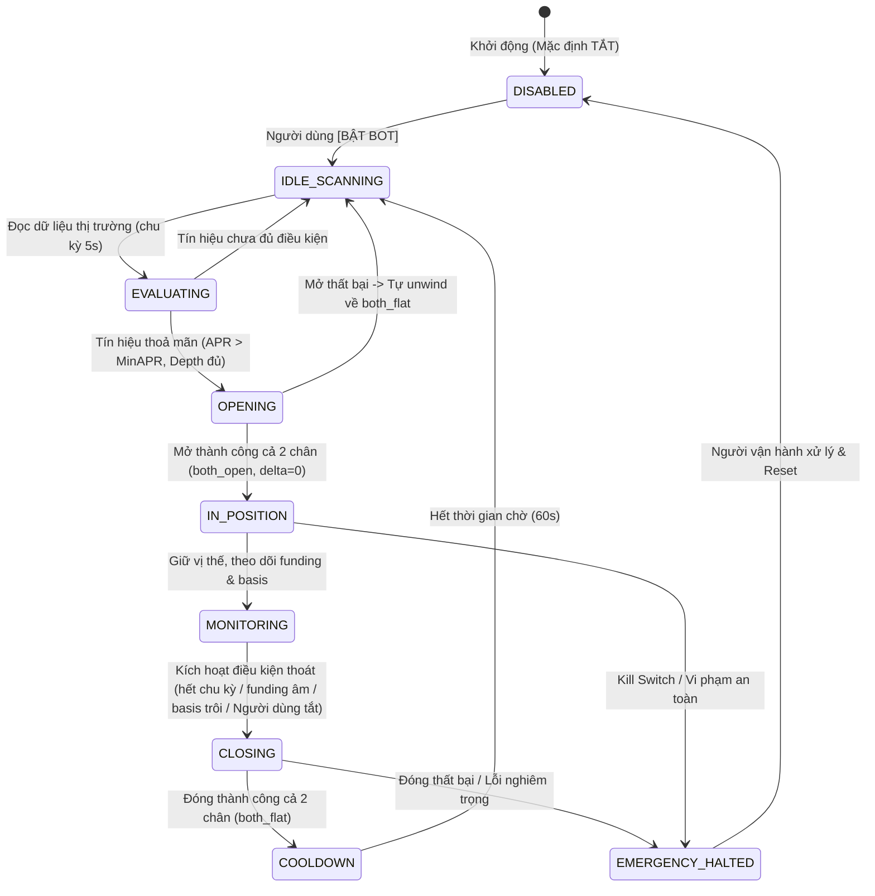

# KẾ HOẠCH TRIỂN KHAI: BOT ĐẶT LỆNH TỰ ĐỘNG TRÊN BINANCE DEMO / TESTNET (BINANCE DEMO AUTO-TRADER)

> **Cập nhật:** 2026-09-15  
> **Người lập:** Senior Project Manager & Tech Lead  
> **Áp dụng:** Binance Testnet / Demo (USDⓈ-M Futures + Spot)  
> **Mục tiêu:** Xây dựng hệ thống Bot tự động đặt lệnh delta-neutral (Cash & Carry Funding Arbitrage) hoàn toàn tự động, độc quyền trên Binance Testnet, có cơ chế ngắt an toàn (Kill Switch) và bảng điều khiển trực quan.

---

## 1. BỐI CẢNH & YÊU CẦU NGHIỆP VỤ

### 1.1. Hiện trạng
- **Giai đoạn 4.4 & 4.5:** Đã hoàn thành và nghiệm thu cơ chế khớp 2 chân delta-neutral và đóng vị thế trên Binance Testnet (`internal/execution`, `cmd/execcheck`, `cmd/execportal`).
- **Thao tác hiện tại:** Hoàn toàn thủ công — người vận hành phải tự bấm nút trên giao diện web (`cmd/execportal` cổng 8087) và xác nhận qua modal popup.
- **Yêu cầu mới từ người vận hành:** *"tiếp theo tôi cần bot đặt lệnh được chỉ trên binance, trên binance hiện tại đã kết nối demo"*.
  - Chuyển từ cơ chế **thủ công (Operator Manual)** sang **tự động hoàn toàn (Auto-Pilot / Automated Bot)**.
  - **Phạm vi nghiêm ngặt:** Chỉ hoạt động trên **Binance** (Spot Testnet `testnet.binance.vision` và USDⓈ-M Futures Testnet `demo-fapi.binance.com`).
  - Đã có sẵn credentials demo trong `.env` (`BINANCE_SPOT_TESTNET_*`, `BINANCE_FUTURES_TESTNET_*`).

### 1.2. Bất biến an toàn tuyệt đối (Safety Guardrails)
1. **BINANCE TESTNET ONLY (Không thể chạm Mainnet):**
   - Ràng buộc host pinning của `internal/broker` chỉ cho phép `testnet.binance.vision` và `demo-fapi.binance.com`. Mọi request đi tới host khác bị từ chối trước khi gửi byte nào (`broker.ErrHostNotPinned`).
2. **BẢO VỆ CỔNG 3.5 BẤT KHẢ XÂM PHẠM:**
   - Tiến trình PID 55475 (`.paper/scanner-bin`, cổng 8085) đang chạy 14 ngày tới phán quyết 2026-09-26 và cơ sở dữ liệu `data/scanner.db` tuyệt đối KHÔNG bị đụng tới, không restart, không can thiệp schema.
3. **MỘT VỊ THẾ DUY NHẤT (Single Concurrent Position):**
   - Bot chỉ quản lý tối đa 1 vị thế mở đồng thời (mặc định cặp `BTCUSDT`, cỡ $65 quote). Tuyệt đối không mở vị thế thứ hai khi vị thế trước chưa đóng phẳng (`both_flat`).
4. **DELTA-NEUTRAL BẮT BUỘC:**
   - Bất biến của `internal/execution`: Khi vào hoặc ra, hoặc **CẢ HAI CHÂN MỞ** với lệch khối lượng `|qty_spot - qty_perp| <= stepSize`, hoặc **CẢ HAI CHÂN PHẲNG** (`both_flat`). Không tồn tại trạng thái chân trần (unhedged). Nếu chân 2 fail, hệ thống tự động gỡ (unwind) chân 1 trong $< 300\text{ ms}$.
5. **KILL SWITCH & CÔNG TẮC VẬN HÀNH:**
   - Bot có trạng thái Bật/Tắt rõ ràng. Người vận hành có thể dừng bot hoặc yêu cầu đóng vị thế khẩn cấp bất kỳ lúc nào qua Web UI hoặc API.
   - Bot tự ngắt (circuit breaker) nếu gặp lỗi sàn liên tiếp 3 lần, lệch đồng hồ $> 1000\text{ ms}$, hoặc tài khoản bị rate-limit.

---

## 2. THIẾT KẾ KIẾN TRÚC AUTO-TRADER

### 2.1. Vị trí module trong hệ thống
Module Auto-Trader được tích hợp trực tiếp bên trong `cmd/execportal` (gói dịch vụ nền `autotrade` hoặc service goroutine trong portal):
- **Lý do lựa chọn tích hợp vào `execportal` thay vì tạo daemon CLI mới:**
  1. Tránh tranh chấp file lock (`.paper/exec`) và tranh chấp nonces/credentials giữa 2 tiến trình độc lập.
  2. Tận dụng hạ tầng đã hoàn thiện: quản lý kết nối broker, đọc thị trường, tính toán kích thước lệnh, cơ chế ghi nhận cache, và loopback security.
  3. Người vận hành có thể trực tiếp giám sát hành vi của Bot, xem log thời gian thực, bật/tắt công tắc và kích hoạt Kill Switch ngay trên Tab 2 (Execution Control) của Web Portal đang chạy ở `127.0.0.1:8087`.

```
cmd/execportal/
├── autotrade/           # [MỚI] Engine tự động hoá giao dịch
│   ├── engine.go        # Vòng lặp quét, máy trạng thái FSM, đánh giá tín hiệu
│   ├── state.go         # Struct trạng thái, cấu hình tham số, logging
│   └── engine_test.go   # Test luồng tự động hoá với broker giả (brokertest)
├── actions.go           # Tận dụng p.open, p.close, p.reconcile
├── api.go               # [BỔ SUNG] REST endpoints cho autotrade
├── main.go              # Khởi tạo engine autotrade, nhận cờ -autotrade nếu muốn chạy nền
└── ...
static/
├── index.html           # [BỔ SUNG] Card Auto-Trader (Demo) trên Tab 2
└── js/execution.js      # [BỔ SUNG] Logic điều khiển, cập nhật trạng thái bot real-time
```

### 2.2. Máy trạng thái của Bot (Auto-Trader State Machine)



Các trạng thái chi tiết:
1. **`DISABLED` (Tắt):** Bot ở trạng thái nghỉ, không đọc tín hiệu, không đặt lệnh.
2. **`IDLE_SCANNING` (Đang quét cơ hội):** Định kỳ mỗi 5–10 giây, bot đọc Binance Testnet (Spot & Futures) cho cặp cấu hình (ví dụ `BTCUSDT`).
3. **`EVALUATING` (Đánh giá tín hiệu):**
   - Đọc funding rate hiện tại và `nextFundingTime`.
   - Tính toán Basis (chênh lệch Spot vs Perp) và độ sâu sổ lệnh (`depth`).
   - Tính toán Net APR dự phóng:
     $$\text{Net APR} = \frac{\text{Funding Rate} \times \text{intervals/năm} \times \text{HoldingDays} - \text{Phí 2 chiều} - \text{Trượt giá}}{\text{HoldingDays}} \times 365$$
   - Điều kiện Vào lệnh (Entry Condition):
     - Funding rate $> 0$ (Perp short nhận funding).
     - $\text{Net APR} \ge \text{MinNetAPRPct}$ (mặc định $\ge 5.0\%$/năm).
     - Độ sâu sổ lệnh 0.5% $\ge 2 \times \text{Notional}$ ($130 quote).
     - Thời gian tới mốc settle $> 5\text{ phút}$ (tránh vào sát nút trượt giá).
     - Không có vị thế nào đang mở (`both_flat`).
4. **`OPENING` (Đang đặt lệnh mở vị thế):**
   - Tự động gọi hàm mở vị thế (`p.open`) với notional quy định ($65 quote).
   - Kiểm tra kết quả: Nếu `both_open` và `delta_residual == 0` $\to$ chuyển sang `IN_POSITION`.
   - Nếu bị từ chối hoặc lỗi unwind $\to$ ghi nhận lỗi, quay lại quét hoặc cảnh báo.
5. **`IN_POSITION` / `MONITORING` (Đang giữ & giám sát vị thế):**
   - Theo dõi sự kiện mốc settle đi qua và đối soát tiền funding nhận được từ Binance API.
   - Giám sát khoảng cách thanh lý và mức ký quỹ duy trì.
   - Điều kiện Thoát lệnh (Exit Condition):
     - Funding rate đảo chiều sang âm (trả tiền funding).
     - Đã nhận đủ số mốc funding mục tiêu (ví dụ sau 1 hoặc $N$ mốc settle).
     - Basis giãn nở bất thường vượt ngưỡng cắt lỗ ($\Delta \text{Basis} > 30\text{ bps}$).
     - Người vận hành bấm [TẮT BOT] hoặc [ĐÓNG VỊ THẾ].
6. **`CLOSING` (Đang đóng vị thế):**
   - Tự động gọi hàm đóng vị thế (`p.close`), đảm bảo cả 2 chân về `both_flat`.
   - Lưu kết quả PnL thực tế vào nhật ký giao dịch.
7. **`COOLDOWN` (Thời gian hồi phục):**
   - Chờ tối thiểu 60 giây trước khi bắt đầu lượt quét mới để tránh giao dịch liên tục dồn dập (churning).
8. **`EMERGENCY_HALTED` (Dừng khẩn cấp):**
   - Bật khi có lỗi sàn liên tiếp, vi phạm delta, hoặc người dùng kích hoạt Kill Switch.

---

## 3. THIẾT KẾ CHI TIẾT API BACKEND

Bổ sung các endpoint quản lý Auto-Trader trong `cmd/execportal/api.go`:

| Endpoint | Method | Input Body | Mô tả chức năng |
|---|---|---|---|
| `GET /api/autotrade/status` | `GET` | Không | Trả về trạng thái máy FSM, cấu hình hiện tại, thông tin vị thế đang giữ, các chỉ số đo lường (Funding, Basis, APR) của lần quét gần nhất, danh sách log sự kiện. |
| `POST /api/autotrade/start` | `POST` | `{"symbol":"BTCUSDT", "notional_quote":65, "min_net_apr_pct":5.0, "max_hold_epochs":1}` | Kích hoạt Bot tự động chạy với các tham số cấu hình. |
| `POST /api/autotrade/stop` | `POST` | `{"close_now":false}` | Dừng chế độ tự động. Nếu `close_now: true`, lập tức kích hoạt đóng vị thế nếu đang giữ. |
| `POST /api/autotrade/kill` | `POST` | Không | **Kill Switch khẩn cấp:** Dừng ngay vòng lặp và lập tức đóng toàn bộ vị thế đang mở. |

---

## 4. THIẾT KẾ GIAO DIỆN NGƯỜI DÙNG (TAB 2: EXECUTION CONTROL)

Thêm một Card chuyên biệt **"Auto-Trader (Binance Demo)"** vào đầu Tab 2 trong `static/index.html`:
1. **Header Card:**
   - Tiêu đề: `Auto-Trader (Binance Demo)` kèm nhãn `TỰ ĐỘNG HÓA`.
   - Badge trạng thái động:
     - Xám: `[TẮT]`
     - Xanh dương nhấp nháy: `[ĐANG QUÉT THỊ TRƯỜNG]`
     - Vàng: `[ĐANG MỞ LỆNH]` / `[ĐANG ĐÓNG LỆNH]`
     - Xanh lá neon: `[ĐANG GIỮ VỊ THẾ - HEDGED]`
     - Đỏ nhấp nháy: `[DỪNG BẢO VỆ]`
   - Nút bật/tắt (Toggle Switch) trực quan: `[BẬT AUTO-TRADING]` / `[TẮT]`.
2. **Bảng thông số cấu hình nhanh:**
   - Cặp giao dịch: `BTCUSDT` (dropdown các cặp demo hợp lệ).
   - Cỡ lệnh Notional: Cố định $65 (hoặc nhập tối đa $100).
   - Ngưỡng Net APR tối thiểu: Mặc định $5.0\%$/năm.
   - Số chu kỳ funding tối đa: 1 mốc settle (8h) hoặc giữ liên tục khi rate $>0$.
3. **Thước đo cơ hội thời gian thực (Live Signal Gauge):**
   - Funding rate Binance hiện tại (bps/8h).
   - Thời gian đếm ngược tới mốc settle tiếp theo (`nextFundingTime`).
   - Basis hiện tại (Spot vs Perp).
   - Net APR dự phóng tức thời $\to$ hiển thị trạng thái `ĐỦ ĐIỀU KIỆN VÀO` hoặc `CHƯA ĐỦ ĐIỀU KIỆN`.
4. **Hộp nút hành động khẩn cấp:**
   - Nút `[DỪNG TỰ ĐỘNG & GIỮ NGUYÊN VỊ THẾ]`
   - Nút màu đỏ cảnh báo `[KILL SWITCH: DỪNG & ĐÓNG NGAY LẬP TỨC]`
5. **Mini-Console Log:**
   - Bảng hiển thị 10 dòng log mới nhất của Bot (ví dụ: `11:42:01 [SCAN] BTCUSDT Funding +1.00 bps, APR 8.2% -> ĐỦ ĐIỀU KIỆN`, `11:42:05 [OPEN] Đã mở thành công 0.0008 BTC cả 2 chân, delta=0`).

---

## 5. KẾ HOẠCH TEST & TIÊU CHÍ NGHIỆM THU

### 5.1. Kiểm thử tự động (Unit Test & Concurrency Guard)
1. **Toàn bộ test suite xanh:** `go test ./...` và `go test -race ./cmd/execportal/...` pass 100%.
2. **State Machine Test với `brokertest`:**
   - Giả lập chu trình: IDLE $\to$ Entry Signal $\to$ Open thành công $\to$ Settle $\to$ Exit Signal $\to$ Close thành công $\to$ Cooldown $\to$ IDLE.
   - Bơm lỗi: Giả lập chân 2 bị lỗi $\to$ Bot tự động unwind chân 1 và chuyển trạng thái an toàn.
   - Test Kill Switch: Kích hoạt kill switch giữa chừng $\to$ Bot lập tức ngừng và giải phóng vị thế.
3. **Guard Test:**
   - Không vi phạm `internal/broker/boundary_test.go`.
   - Duy trì cấm tuyệt đối mọi host mainnet.
   - Không import `cmd/scanner` hay chạm vào SQLite `data/scanner.db`.

### 5.2. Nghiệm thu thực tế trên Binance Testnet
1. Chạy `go run ./cmd/execportal -port 8087`.
2. Mở trình duyệt tại `http://127.0.0.1:8087`, chuyển sang tab **Execution Control**.
3. Bật công tắc `[BẬT AUTO-TRADING]`.
4. Quan sát Bot tự động đánh giá thị trường, gửi lệnh mở vị thế $65 BTCUSDT khi đủ điều kiện.
5. Xác minh vị thế trên sàn:
   - Spot Long và Futures Short khớp đúng khối lượng.
   - Delta residual = 0 (HEDGED).
6. Thử nghiệm nút `[KILL SWITCH]` hoặc để Bot tự đóng khi điều kiện thoát kích hoạt $\to$ vị thế đóng về phẳng (`both_flat`).
7. Xác nhận tiến trình Cổng 3.5 (PID 55475 cổng 8085) vẫn chạy liên tục, không lỗi.

---

## 6. GHI CHÚ TRIỂN KHAI (2026-09-15)

> Tài liệu trên là bản thiết kế người vận hành giao. Bản đã chạy khác nó ở những chỗ
> dưới đây; bản ghi đầy đủ, số đo nghiệm thu và nợ có tên ở
> [PLAN.md — "Công cụ vận hành 4.5d"](PLAN.md) và quyết định **Q18** (§7.1).

1. **Quyết định Q18.** Nhiệm vụ đảo giới hạn 5 của Q15 ("không có đường từ tín hiệu sống
   tới lệnh"), nên đã hỏi trước khi viết code. Người vận hành chọn ghi Q18: bot tự đặt
   lệnh CHỈ trên testnet và CHỈ trong `cmd/execportal/autotrade`; tín hiệu của cổng 3.5
   vẫn không tới được lệnh nào.
2. **Công thức Net APR ở §2.2 không cân đơn vị** (`rate × kỳ/năm × ngày giữ`). Bản chạy
   dùng `strategy.NetAPR`: lợi nhuận kỳ giữ = rate × số mốc settle trong kỳ giữ − chi phí
   vòng (phí taker 4 lượt + trượt giá ước từ sổ lệnh), quy năm bằng 365 / số ngày giữ.
   Con số là trên notional MỘT chân; trang hiện thêm con số trên vốn (1,5× notional).
3. **Mặc định `max_hold_epochs` = 0** (giữ khi funding còn dương, dự phóng 30 ngày), không
   phải 1: giữ một mốc ở ~1 bps/8h không bao giờ trả được một vòng phí, nên bot sẽ không
   vào lệnh. Người vận hành chọn.
4. **Dự phóng trên trung bình 7 ngày các mốc ĐÃ SETTLE** ở chu kỳ đo từ lịch sử
   (`GET /fapi/v1/fundingRate`); `lastFundingRate` vẫn phải > 0 nhưng không dùng để dự
   phóng. Thoát "funding ≤ 0" đọc mốc đã settle SAU lúc vào.
5. **Phí đọc từ chính tài khoản testnet** (`/fapi/v1/commissionRate`,
   `/api/v3/account/commission`): spot 0, futures taker 4 bps.
6. **Thêm điều kiện** lệch đồng hồ ≤ 1000 ms và kiểm chéo chu kỳ với `nextFundingTime`.
   "Lỗi sàn liên tiếp 3 lần" là hai bộ đếm (đọc / giao dịch); lịch sử funding không đọc
   được khi đang giữ có ngân sách 30 phút.
7. **Kill switch chỉ đóng cặp CỦA BOT** (intent `a…`), không đụng vị thế người vận hành
   mở; không huỷ lệnh đã gửi mà chờ nó trả về rồi đóng; không bao giờ làm phẳng cặp lệch.
8. **Endpoint:** như §3, thêm header riêng `autotrade-stop-close` cho `stop` có
   `close_now: true`. Handler nằm ở `cmd/execportal/autotrade.go` (không phải `api.go`) để
   mọi đường của bot nằm trong một file mà guard test đọc được.
9. **Nghiệm thu 2026-09-15:** bấm BẬT thật → bot tự mở $65 BTCUSDT sau 5,0 s (Net APR dự
   phóng +6,05%/năm trên notional), lệch 0, cửa sổ trần 391 ms; KILL → phẳng sau 6,0 s;
   `execcheck -status` xác nhận từ sàn; cổng 3.5 không bị đụng.

