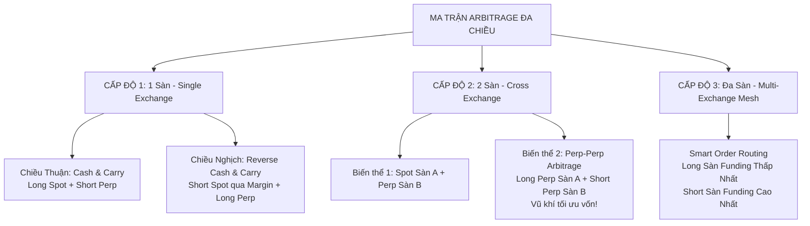

# MA TRẬN CHIẾN LƯỢC ARBITRAGE ĐA CHIỀU & ĐA SÀN (MULTI-DIRECTIONAL & MULTI-EXCHANGE ARBITRAGE MATRIX)

> **Cập nhật:** 2026-09-17  
> **Tác giả & Kiến trúc:** Senior Quantitative Architect & Operator Vision  
> **Trạng thái:** Đặc tả kiến trúc chiến lược tổng thể (Master Strategy Blueprint)  
> **Tài liệu liên quan:** [docs/PLAN.md](PLAN.md) · [docs/BYBIT-BROKER-PLAN.md](BYBIT-BROKER-PLAN.md) · [docs/AUTOTRADE-CONVERGENCE-HOLDING-STRATEGY.md](AUTOTRADE-CONVERGENCE-HOLDING-STRATEGY.md)

---

## 1. TỔNG QUAN & NGUYÊN LÝ CỐT LÕI

Một hệ thống Arbitrage đỉnh cao theo mô hình của các **Quỹ định lượng chuyên nghiệp (Quantitative Hedge Funds)** không bao giờ chỉ đi một chân hay một chiều đơn lẻ, mà phải bao phủ **Ma trận 3 cấp độ** để thích ứng và kiếm lợi nhuận trong **MỌI ĐIỀU KIỆN THỊ TRƯỜNG** (Uptrend, Downtrend hay Sideway).

Nguyên tắc bất di bất dịch của toàn bộ ma trận: **Delta-Neutral tuyệt đối ($Δ = 0$)** — triệt tiêu 100% rủi ro biến động giá của thị trường crypto, chỉ khai thác dòng tiền chênh lệch Funding Rate và sự hội tụ của Basis.

---

## 2. MA TRẬN CHIẾN LƯỢC 3 CẤP ĐỘ

---

### CẤP ĐỘ 1: Tối ưu triệt để trên 1 Sàn (Single-Exchange)

Không chỉ ăn funding dương, mà phải ăn trọn cả funding âm khi thị trường hoảng loạn:

#### 1. Chiều Thuận (Cash & Carry — Đã có trong bot):
* **Điều kiện thị trường:** Funding Rate $> 0$ (thị trường tăng trưởng hoặc bình thường, phe Long trả tiền lãi định kỳ cho phe Short).
* **Cặp lệnh thực thi:** **`Long Spot + Short Futures (Perp)`**
* **Dòng tiền sinh lời:** Thu tiền Funding Rate định kỳ từ phe Long + Lãi hội tụ Basis khi đóng vị thế.
* **Hạn chế:** Cần 100% vốn tiền tươi để mua Spot, không sử dụng đòn bẩy ở chân Spot ($K = 1.5$).

#### 2. Chiều Nghịch (Reverse Cash & Carry — Mở rộng tiếp theo):
* **Điều kiện thị trường:** Thị trường sập mạnh / hoảng loạn (Flash Dump), Funding Rate bị **ÂM NẶNG** ($-50\%$ đến $-100\%$/năm, tức **phe Short phải nộp tiền phạt cho phe Long**).
* **Cặp lệnh thực thi:** **`Bán Spot (Short Spot qua Margin) + Long Futures (Perp)`**
* **Dòng tiền sinh lời:** Thu tiền thưởng Funding Rate khổng lồ từ phe Short trả sang.
* **Cơ chế kỹ thuật:** 
  * Bot sử dụng tính năng Margin của sàn (Binance Margin / Bybit UTA Margin) để tự động vay coin cơ sở (Auto-Borrow Spot).
  * Lập tức bán Spot lấy USDT/USD, và dùng tiền đó mở vị thế **Long Futures đối ứng**.
  * Lãi vay Spot của sàn thường chỉ khoảng **2% - 5%/năm**, trong khi tiền Funding âm thu về đạt từ **30% - 100%/năm** $\rightarrow$ Biên lợi nhuận ròng cực kỳ dày!

---

### CẤP ĐỘ 2: Chéo 2 Sàn (Cross-Exchange: Binance $\leftrightarrow$ Bybit)

Khi tích hợp thêm sàn thứ 2 (Bybit V5 ở Bước 4.5i), hệ thống mở khóa 2 biến thể chiến lược cấp cao:

#### Biến thể 1: Spot Sàn A $\leftrightarrow$ Futures Sàn B (Cross Cash & Carry)
* **Kịch bản:** Giá Spot bên Binance rẻ hơn Bybit, hoặc sàn Bybit đang trả Funding Rate cao hơn hẳn Binance.
* **Lệnh:** **`Long Spot Binance + Short Perp Bybit`** (hoặc ngược lại).
* Khai thác triệt để chênh lệch giá cơ sở giữa 2 sàn thanh khoản lớn nhất thế giới.

#### Biến thể 2: Futures Sàn A $\leftrightarrow$ Futures Sàn B (Perp-Perp Arbitrage — Vũ khí tối ưu vốn)
* **Kịch bản:** 
  * Sàn A (ví dụ Binance Perp): Funding Rate đang rất cao: `+0.08%/8h` (+87%/năm).
  * Sàn B (ví dụ Bybit Perp): Funding Rate thấp hoặc âm: `+0.01%/8h` (+11%/năm).
* **Cặp lệnh thực thi:** **`Long Perp Bybit + Short Perp Binance`** (hoặc ngược lại).
* **Điểm đột phá vượt trội:**
  1. **KHÔNG CẦN MUA SPOT:** Hoàn toàn giải phóng khỏi việc phải bỏ 100% tiền tươi mua coin ở Spot.
  2. **TỐI ƯU VỐN GẤP 3 - 4 LẦN:** Cả 2 chân đều là hợp đồng phái sinh, sử dụng đòn bẩy an toàn $2\text{x} - 3\text{x}$. Thay vì cần $15,000$ vốn cho $10,000$ notional như Spot-Perp, Perp-Perp chỉ cần khoảng **$3,000 - $5,000$ vốn ký quỹ**!
  3. **LỢI NHUẬN RÒNG ĐỀU ĐẶN:** Nhận $+0.08\%$ từ Binance, trả $-0.01\%$ cho Bybit $\rightarrow$ Thu ròng **$+0.07\%/8h$ tiền mặt** mà không chịu rủi ro biến động giá (Delta-Neutral).
  4. **PHÍ GIAO DỊCH RẺ:** Phí Taker/Maker Futures rẻ hơn nhiều so với Spot.

---

### CẤP ĐỘ 3: Đa Sàn (Multi-Exchange Mesh: Binance + Bybit + Hyperliquid + OKX...)

Đỉnh cao của hệ thống định lượng tự động:
* **Quét toàn thị trường trong mili-giây:**
  * Giám sát đồng thời hàng chục sàn CEX và DEX (Hyperliquid, Paradex, Kraken, Gate...).
* **Định tuyến lệnh thông minh (Smart Order Routing):**
  * Với mỗi tài sản (BTC, ETH, SOL, NEAR, SUI...):
    * Tự động tìm ra sàn có Funding Rate **THẤP NHẤT (hoặc ÂM NHẤT)** $\rightarrow$ Đặt lệnh **LONG**.
    * Tự động tìm ra sàn có Funding Rate **CAO NHẤT** $\rightarrow$ Đặt lệnh **SHORT**.
  * Tự động tính toán chi phí trượt giá (depth slippage) và phí sàn để đảm bảo Net APR luôn dương $> 15\%$.
  * Tự động cân bằng vị thế hai đầu để khóa trọn biên độ chênh lệch lớn nhất toàn cầu.

---

## 3. BẢNG SO SÁNH HIỆU QUẢ CÁC CẤP ĐỘ CHIẾN LƯỢC

| Tiêu chí | Cấp 1: Spot-Perp Thuận | Cấp 1: Spot-Perp Nghịch (Margin) | Cấp 2: Perp-Perp Chéo Sàn | Cấp 3: Multi-Exchange Mesh |
| :--- | :---: | :---: | :---: | :---: |
| **Thị trường áp dụng** | Uptrend / Funding dương | Downtrend / Funding âm | Khi 2 sàn lệch Funding | Mọi điều kiện thị trường |
| **Đòn bẩy chân 1** | Không (Spot 1x) | Margin Spot (1.5x - 2x) | Futures (2x - 3x) | Futures (2x - 3x) |
| **Đòn bẩy chân 2** | Futures (2x - 3x) | Futures (2x - 3x) | Futures (2x - 3x) | Futures (2x - 3x) |
| **Hiệu quả vốn (Capital Efficiency)** | Tiêu chuẩn ($K=1.5$) | Khá ($K=1.3$) | **Rất cao ($K=0.3 - 0.5$)** | **Tối ưu cực đại** |
| **Phí giao dịch** | Phí Spot + Phí Futures | Phí Spot + Lãi vay + Phí Futures | **Chỉ phí Futures (rất rẻ)** | Chỉ phí Futures (rất rẻ) |
| **Rủi ro chính** | Phí sàn & trượt giá | Lãi vay Spot tăng đột biến | Lệch Basis giữa 2 sàn Perp | Phân mảnh ký quỹ đa sàn |

---

## 4. QUẢN TRỊ RỦI RO & BẢO VỆ VỐN (RISK GUARDRAILS)

1. **Giới hạn đòn bẩy phái sinh:** Tuyệt đối không dùng đòn bẩy quá $3\text{x}$ cho cả 2 chân Perp để tránh rủi ro quét râu thanh lý (liquidation wick).
2. **Cơ chế Tái cân bằng Ký quỹ (Cross-Margin Rebalancing):**
   * Trong Perp-Perp, khi giá thị trường tăng mạnh, chân Short bị hao hụt ký quỹ trong khi chân Long lãi lớn.
   * Bot cần có cảnh báo mức đệm Margin Ratio để người vận hành chuyển vốn phòng ngừa hoặc bot tự động giảm size (de-leverage).
3. **Van chặn Spread ($\le 10\text{ bps}$):** Kế thừa toàn bộ logic từ [signal.go](file:///Users/mtls/Project/crypto-futures-arbitrage-scanner/cmd/execportal/autotrade/signal.go) để không bao giờ đóng lệnh khi sổ lệnh của bất kỳ sàn nào bị giãn mỏng.

---

## 5. LỘ TRÌNH TRIỂN KHAI THEO PLAN.MD

| Giai đoạn | Nội dung kỹ thuật | Trạng thái hiện tại |
| :---: | :--- | :---: |
| **GĐ 1** | **Single-Exchange (Binance)**: Cash & Carry (`Long Spot + Short Perp`) có van chặn Spread $\le 10\text{ bps}$ và chốt lời $1.50\%$. | ✅ **Hoàn thành (Đang chạy Testnet)** |
| **GĐ 2** | **Single-Exchange Reverse**: Tích hợp Margin Borrow cho chân Spot để ăn Funding âm khi thị trường sập (`Short Spot + Long Perp`). | 🟡 **Kế hoạch mở rộng** |
| **GĐ 3** | **Two-Exchange Broker (Bước 4.5i)**: Hoàn thành `internal/broker/bybit` $\rightarrow$ triển khai **Perp-Perp Arbitrage** (`Long Bybit + Short Binance`). | 🟡 **Đang tiến hành** |
| **GĐ 4** | **Multi-Exchange Mesh (GĐ 5 & 7)**: Kết nối Hyperliquid DEX và OKX $\rightarrow$ kích hoạt Smart Order Routing đa sàn toàn diện. | 🎯 **Giai đoạn tương lai** |
