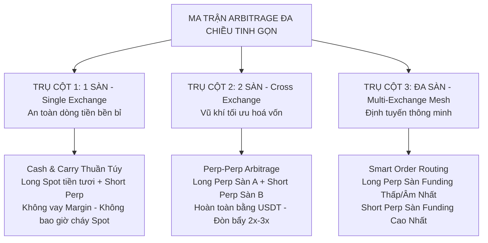

# MA TRẬN CHIẾN LƯỢC ARBITRAGE ĐA CHIỀU & ĐA SÀN (MULTI-DIRECTIONAL & MULTI-EXCHANGE ARBITRAGE MATRIX)

> **Cập nhật:** 2026-09-17  
> **Tác giả & Kiến trúc:** Senior Quantitative Architect & Operator Vision  
> **Trạng thái:** Đặc tả kiến trúc chiến lược chuẩn hóa (Pragmatic Strategy Blueprint)  
> **Tài liệu liên quan:** [docs/PLAN.md](PLAN.md) · [docs/BYBIT-BROKER-PLAN.md](BYBIT-BROKER-PLAN.md) · [docs/AUTOTRADE-CONVERGENCE-HOLDING-STRATEGY.md](AUTOTRADE-CONVERGENCE-HOLDING-STRATEGY.md)

---

## 1. TRIẾT LÝ THIẾT KẾ: TINH GỌN, AN TOÀN VÀ TỐI ĐA HOÁ VỐN

Trong giao dịch định lượng thực chiến, **sự đơn giản và an toàn là yếu tố sống còn**. Thay vì sa đà vào các cơ chế phức tạp như vay mượn coin (Spot Margin Borrowing) vốn đi kèm rủi ro thanh lý kép và lãi vay bào mòn lợi nhuận, hệ thống định hình **2 Trụ cột chiến lược phân tách rành mạch**:

1. **Trên 1 Sàn (Single-Exchange):** Giữ thuần túy **`Long Spot + Short Futures` (Cash & Carry)**. 
   - Chân Spot mua bằng 100% tiền tươi $\rightarrow$ **Spot KHÔNG BAO GIỜ bị thanh lý**, 0 lãi vay, vận hành bền bỉ.
2. **Khi muốn LONG FUTURES (Ăn Funding âm hoặc bắt lệch Rate):** **KHÔNG đi vay coin để bán Spot**, mà thực hiện **`Long Futures Sàn A + Short Futures Sàn B` (Perp-Perp Arbitrage)**!
   - Cả 2 chân đều là phái sinh USDT, không cần sở hữu coin thật, tận dụng đòn bẩy an toàn $2\text{x} - 3\text{x}$, tối ưu hóa hiệu quả sử dụng vốn gấp 3 – 4 lần!

---

## 2. MA TRẬN CHIẾN LƯỢC TINH GỌN

---

### TRỤ CỘT 1: Tối ưu trên 1 Sàn (Single-Exchange Cash & Carry)

* **Cặp lệnh thực thi:** **`Long Spot (Tiền tươi) + Short Futures (Perp)`**
* **Điều kiện thị trường:** Funding Rate $> 0$ (chiếm ~80% thời gian trên thị trường crypto).
* **Dòng tiền sinh lời:** Thu tiền Funding Rate định kỳ từ phe Long nộp + Thu thêm lợi nhuận hội tụ Basis khi đóng vị thế.
* **Vì sao KHÔNG làm Chiều Nghịch (Short Spot) trên 1 sàn?**
  * Để bán Spot khi không có coin, bắt buộc phải dùng Margin để vay coin từ sàn.
  * *Bẫy rủi ro của Spot Margin:*
    1. **Bị tính lãi vay (Borrow Interest):** Sàn tính lãi vay coin từ $3\% - 15\%/\text{năm}$, triệt tiêu phần lớn tiền funding thu được.
    2. **Rủi ro cháy tài khoản Spot:** Nếu giá coin bất ngờ giật mạnh x2, khoản nợ coin tăng vọt làm cháy ví ký quỹ Spot!
    3. **Hết hạn mức vay:** Sàn thường xuyên khóa hạn mức vay đối với các altcoin biến động mạnh.
  * **Giải pháp:** Giữ chân Spot thuần túy 100% tiền tươi để đảm bảo **Spot an toàn tuyệt đối, không bao giờ bị thanh lý**.

---

### TRỤ CỘT 2: Chéo 2 Sàn (Two-Exchange Perp-Perp Arbitrage)

Khi kết nối sàn thứ 2 (Bybit V5 ở Bước 4.5i), bất cứ khi nào xuất hiện cơ hội **Long Futures** (thị trường funding âm hoặc chênh lệch rate giữa 2 sàn lớn), bot sẽ kích hoạt **Perp-Perp Arbitrage**:

* **Kịch bản thực tế:**
  * Sàn Bybit: Funding Rate bị âm nặng **`-0.08%/8h`** (hoặc thấp).
  * Sàn Binance: Funding Rate dương **`+0.02%/8h`** (hoặc cao).
* **Cặp lệnh thực thi:**
  * **Chân 1:** **`LONG FUTURES trên Bybit`** $\rightarrow$ Nhận tiền thưởng funding `+0.08%` từ phe Short Bybit nộp.
  * **Chân 2:** **`SHORT FUTURES trên Binance`** $\rightarrow$ Nhận thêm `+0.02%` từ phe Long Binance nộp.
* **4 Đột phá mang tính quyết định:**
  1. **GIẢI QUYẾT TRIỆT ĐỂ BÀI TOÁN "LONG FUTURES":** Ăn trọn vẹn tiền thưởng funding âm của thị trường mà không cần sở hữu hay vay mượn bất kỳ 1 đồng coin cơ sở nào!
  2. **100% GIAO DỊCH BẰNG USDT/USDC:** Cả 2 sàn đều nạp và rút bằng stablecoin, không rủi ro biến động giá trị tài sản gốc.
  3. **HIỆU QUẢ SỬ DỤNG VỐN GẤP 3 – 4 LẦN:** Cả 2 chân đều dùng đòn bẩy phái sinh an toàn $2\text{x} - 3\text{x}$. Với vị thế $10,000\$$ notional, bạn chỉ cần khoảng **$3,000 - $5,000 vốn ký quỹ** (so với $15,000$ vốn ở Spot-Perp).
  4. **PHÍ GIAO DỊCH CỰC RẺ:** Không chịu phí Spot (0.10%), toàn bộ là phí phái sinh Taker/Maker (0.02% - 0.05%).

---

### TRỤ CỘT 3: Đa Sàn Thông Minh (Multi-Exchange Mesh Routing)

Khi mở rộng sang nhiều sàn (Binance + Bybit + Hyperliquid DEX + OKX...):
* **Hệ thống quét tự động toàn cầu:** Quét toàn bộ ma trận $N \times (N-1)$ cặp sàn trong 1 giây.
* **Smart Order Routing (Định tuyến lệnh thông minh):**
  * Tự động chọn sàn có Funding Rate **THẤP NHẤT / ÂM NHẤT** $\rightarrow$ Bắn lệnh **LONG PERP**.
  * Tự động chọn sàn có Funding Rate **CAO NHẤT** $\rightarrow$ Bắn lệnh **SHORT PERP**.
  * Tự động tính toán trượt giá (depth slippage) ở cả 2 đầu sổ lệnh để đảm bảo khóa trọn mức Net APR ròng cao nhất thị trường.

---

## 3. BẢNG SO SÁNH TRỰC DIỆN HAI MÔ HÌNH CHÍNH

| Tiêu chí | Trụ cột 1: Spot-Perp (1 Sàn) | Trụ cột 2: Perp-Perp (2 Sàn) |
| :--- | :---: | :---: |
| **Bản chất lệnh** | Long Spot tiền tươi + Short Perp | Long Perp Sàn A + Short Perp Sàn B |
| **Tài sản cần có** | USDT + Coin Spot thật | **Chỉ cần USDT ký quỹ ở cả 2 sàn** |
| **Vay mượn Margin** | **KHÔNG** (Tránh hoàn toàn rủi ro vay) | **KHÔNG** (Giao dịch hợp đồng phái sinh) |
| **Hệ số an toàn vốn ($K$)** | $K = 1.5$ (Cần $15,000$ vốn cho $10,000$ lệnh) | **$K = 0.3 - 0.5$ (Chỉ cần $3,000 - $5,000$ vốn)** |
| **Rủi ro cháy tài khoản** | Chân Spot $0\%$ cháy; Chân Perp phòng ngừa râu nến | Giữ đòn bẩy $2\text{x} - 3\text{x}$ an toàn cho cả 2 sàn |
| **Phí giao dịch sàn** | Phí Spot + Phí Futures | **Chỉ phí Futures (rẻ hơn 50% - 70%)** |
| **Khả năng ăn Funding âm** | Không hỗ trợ (Bỏ qua đợt sập) | **Hỗ trợ cực mạnh (Ăn kép cả 2 đầu sàn)** |

---

## 4. QUY TẮC AN TOÀN VỐN CHO PERP-PERP (SAFETY RULES)

1. **Giới hạn đòn bẩy:** Mặc định $2\text{x}$, tối đa không quá $3\text{x}$ ở cả 2 chân để triệt tiêu nguy cơ thanh lý do quét râu (liquidation wick).
2. **Giám sát Ký quỹ 2 đầu (Dual-Margin Healthcheck):**
   * Vì 2 sàn chạy đòn bẩy độc lập, khi thị trường tăng mạnh, sàn Short bị hao hụt ký quỹ trong khi sàn Long sinh lời lớn.
   * Bot tích hợp cảnh báo Margin Ratio để người vận hành cân đối vốn giữa 2 ví hoặc bot tự động giảm size an toàn.
3. **Van chặn Spread ($\le 10\text{ bps}$):** Áp dụng van chặn spread touch ở cả 2 sàn phái sinh trước khi đặt lệnh mở hoặc đóng để bảo toàn lợi nhuận.

---

## 5. LỘ TRÌNH TRIỂN KHAI THEO PLAN.MD

| Mốc | Trọng tâm công việc | Trạng thái |
| :---: | :--- | :---: |
| **GĐ 1** | **Single-Exchange (Binance Testnet)**: Chạy ổn định `Long Spot + Short Perp` với Take Profit $1.50\%$ và Van chặn Spread $\le 10\text{ bps}$. | ✅ **Hoàn thành (Đang chạy 8 vị thế)** |
| **GĐ 2** | **Kết nối Bybit Broker (Bước 4.5i)**: Xây dựng `internal/broker/bybit`, xác thực HMAC V5, kiểm thử `cmd/bybitcheck`. | 🟡 **Đang tiến hành** |
| **GĐ 3** | **Perp-Perp Cross-Exchange (Bước 4.5j)**: Mở rộng `internal/execution` hỗ trợ `PosTypePerpPerp`, thử nghiệm đặt 2 chân `Long Bybit + Short Binance` trên Testnet. | 🎯 **Kế hoạch tiếp theo** |
| **GĐ 4** | **Multi-Exchange Mesh (GĐ 5 & 7)**: Mở rộng sang Hyperliquid DEX và OKX để kích hoạt Smart Routing. | 🎯 **Mục tiêu mở rộng** |
