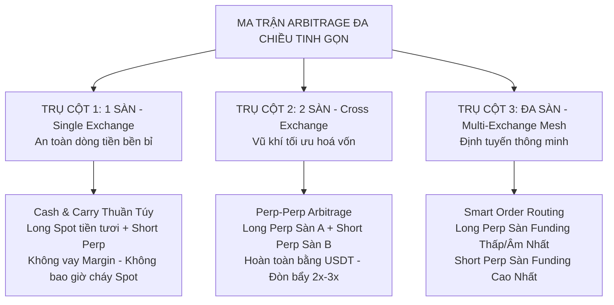

# MA TRẬN CHIẾN LƯỢC ARBITRAGE ĐA CHIỀU & ĐA SÀN (MULTI-DIRECTIONAL & MULTI-EXCHANGE ARBITRAGE MATRIX)

> **Cập nhật:** 2026-09-17  
> **Tác giả & Kiến trúc:** Senior Quantitative Architect & Operator Vision  
> **Trạng thái:** Đặc tả kiến trúc chiến lược chuẩn hóa (Pragmatic Strategy Blueprint)  
> **Tài liệu liên quan:** [docs/PLAN.md](PLAN.md) · [docs/BYBIT-BROKER-PLAN.md](BYBIT-BROKER-PLAN.md) · [docs/AUTOTRADE-CONVERGENCE-HOLDING-STRATEGY.md](AUTOTRADE-CONVERGENCE-HOLDING-STRATEGY.md)

---

## 1. TRIẾT LÝ THIẾT KẾ: TINH GỌN, AN TOÀN VÀ TỐI ĐA HOÁ VỐN

Trong giao dịch định lượng thực chiến, **sự đơn giản và an toàn là yếu tố sống còn**. Thay vì sa đà vào các cơ chế phức tạp như vay mượn coin (Spot Margin Borrowing) vốn đi kèm rủi ro thanh lý kép và lãi vay bào mòn lợi nhuận, hệ thống định hình **2 Trụ cột chiến lược phân tách rành mạch**:

1. **Trên 1 Sàn (Single-Exchange):** Giữ thuần túy **`Long Spot + Short Futures` (Cash & Carry)**. 
   - Chân Spot mua bằng 100% tiền tươi $\rightarrow$ **Spot KHÔNG BAO GIỜ bị thanh lý**, 0 lãi vay, vận hành bền bỉ.
2. **Khi muốn LONG FUTURES (Ăn Funding âm hoặc bắt lệch Rate):** **KHÔNG đi vay coin để bán Spot**, mà thực hiện **`Long Futures Sàn A + Short Futures Sàn B` (Perp-Perp Arbitrage)**!
   - Cả 2 chân đều là phái sinh USDT, không cần sở hữu coin thật, tận dụng đòn bẩy an toàn $2\text{x} - 3\text{x}$, tối ưu hóa hiệu quả sử dụng vốn gấp 3 – 4 lần!

---

## 2. MA TRẬN CHIẾN LƯỢC TINH GỌN

---

### TRỤ CỘT 1: Tối ưu trên 1 Sàn (Single-Exchange Cash & Carry)

* **Cặp lệnh thực thi:** **`Long Spot (Tiền tươi) + Short Futures (Perp)`**
* **Điều kiện thị trường:** Funding Rate $> 0$ (chiếm ~80% thời gian trên thị trường crypto).
* **Dòng tiền sinh lời:** Thu tiền Funding Rate định kỳ từ phe Long nộp + Thu thêm lợi nhuận hội tụ Basis khi đóng vị thế.
* **Vì sao KHÔNG làm Chiều Nghịch (Short Spot) trên 1 sàn?**
  * Để bán Spot khi không có coin, bắt buộc phải dùng Margin để vay coin từ sàn.
  * *Bẫy rủi ro của Spot Margin:*
    1. **Bị tính lãi vay (Borrow Interest):** Sàn tính lãi vay coin từ $3\% - 15\%/\text{năm}$, triệt tiêu phần lớn tiền funding thu được.
    2. **Rủi ro cháy tài khoản Spot:** Nếu giá coin bất ngờ giật mạnh x2, khoản nợ coin tăng vọt làm cháy ví ký quỹ Spot!
    3. **Hết hạn mức vay:** Sàn thường xuyên khóa hạn mức vay đối với các altcoin biến động mạnh.
  * **Giải pháp:** Giữ chân Spot thuần túy 100% tiền tươi để đảm bảo **Spot an toàn tuyệt đối, không bao giờ bị thanh lý**.

---

### TRỤ CỘT 2: Chéo 2 Sàn (Two-Exchange Perp-Perp Arbitrage)

Khi kết nối sàn thứ 2 (Bybit V5 ở Bước 4.5i), bất cứ khi nào xuất hiện cơ hội **Long Futures** (thị trường funding âm hoặc chênh lệch rate giữa 2 sàn lớn), bot sẽ kích hoạt **Perp-Perp Arbitrage**:

* **Kịch bản thực tế:**
  * Sàn Bybit: Funding Rate bị âm nặng **`-0.08%/8h`** (hoặc thấp).
  * Sàn Binance: Funding Rate dương **`+0.02%/8h`** (hoặc cao).
* **Cặp lệnh thực thi:**
  * **Chân 1:** **`LONG FUTURES trên Bybit`** $\rightarrow$ Nhận tiền thưởng funding `+0.08%` từ phe Short Bybit nộp.
  * **Chân 2:** **`SHORT FUTURES trên Binance`** $\rightarrow$ Nhận thêm `+0.02%` từ phe Long Binance nộp.
* **4 Đột phá mang tính quyết định:**
  1. **GIẢI QUYẾT TRIỆT ĐỂ BÀI TOÁN "LONG FUTURES":** Ăn trọn vẹn tiền thưởng funding âm của thị trường mà không cần sở hữu hay vay mượn bất kỳ 1 đồng coin cơ sở nào!
  2. **100% GIAO DỊCH BẰNG USDT/USDC:** Cả 2 sàn đều nạp và rút bằng stablecoin, không rủi ro biến động giá trị tài sản gốc.
  3. **TỐI ƯU VỐN KÝ QUỸ (Hiệu quả $K/2$):** Cả 2 chân đều dùng đòn bẩy phái sinh an toàn $2\text{x} - 3\text{x}$. Ký quỹ nằm trên 2 sàn độc lập ($N/K$ mỗi sàn, tổng vốn $2N/K$). Với vị thế $10,000\$$ notional mỗi chân: đòn bẩy $2\text{x}$ cần $10,000\$$ vốn tổng (hiệu quả $1.0\text{x}$); đòn bẩy $3\text{x}$ cần khoảng $6,666\$$ vốn tổng (hiệu quả $1.5\text{x}$, tiết kiệm hơn đáng kể so với $15,000\$$ vốn ở Spot-Perp).
  4. **PHÍ GIAO DỊCH CỰC RẺ:** Không chịu phí Spot (0.10%), toàn bộ là phí phái sinh Taker/Maker (0.02% - 0.05%).

---

### TRỤ CỘT 3: Đa Sàn Thông Minh (Multi-Exchange Mesh Routing)

Khi mở rộng sang nhiều sàn (Binance + Bybit + Hyperliquid DEX + OKX...):
* **Hệ thống quét tự động toàn cầu:** Quét toàn bộ ma trận $N \times (N-1)$ cặp sàn trong 1 giây.
* **Smart Order Routing (Định tuyến lệnh thông minh):**
  * Tự động chọn sàn có Funding Rate **THẤP NHẤT / ÂM NHẤT** $\rightarrow$ Bắn lệnh **LONG PERP**.
  * Tự động chọn sàn có Funding Rate **CAO NHẤT** $\rightarrow$ Bắn lệnh **SHORT PERP**.
  * Tự động tính toán trượt giá (depth slippage) ở cả 2 đầu sổ lệnh để đảm bảo khóa trọn mức Net APR ròng cao nhất thị trường.

---

## 3. BẢNG SO SÁNH TRỰC DIỆN HAI MÔ HÌNH CHÍNH

| Tiêu chí | Trụ cột 1: Spot-Perp (1 Sàn) | Trụ cột 2: Perp-Perp (2 Sàn) |
| :--- | :---: | :---: |
| **Bản chất lệnh** | Long Spot tiền tươi + Short Perp | Long Perp Sàn A + Short Perp Sàn B |
| **Tài sản cần có** | USDT + Coin Spot thật | **Chỉ cần USDT ký quỹ ở cả 2 sàn** |
| **Vay mượn Margin** | **KHÔNG** (Tránh hoàn toàn rủi ro vay) | **KHÔNG** (Giao dịch hợp đồng phái sinh) |
| **Hiệu quả sử dụng vốn** | Vốn $= (1 + 0.5) N = 1.5N$ | **Vốn $= 2N/K$ ($1.0N$ ở $2\text{x}$; $0.67N$ ở $3\text{x}$)** |
| **Rủi ro cháy tài khoản** | Chân Spot $0\%$ cháy; Chân Perp phòng ngừa râu nến | Giữ đòn bẩy $2\text{x} - 3\text{x}$ an toàn, van ngắt ký quỹ $65\%$ |
| **Phí giao dịch sàn** | Phí Spot (0.10%) + Phí Futures (0.05%) | **Chỉ phí Futures (21 bps cả vòng 4 lệnh)** |
| **Khả năng ăn Funding âm** | Không hỗ trợ (Bỏ qua đợt sập) | **Hỗ trợ cực mạnh (Ăn kép cả 2 đầu sàn)** |
| **Thời gian giữ lệnh** | **Trung & Dài hạn (10 – 60 ngày)** | **Chiến thuật ngắn hạn (1 – 3 ngày khi có sóng)** |
| **Mục tiêu chốt lời** | **+1.50% trên vốn** theo hội tụ Basis | **Đóng khi chênh lệch $\Delta f \le 0$** |

---

## 4. NGUYÊN TẮC VẬN HÀNH SONG SONG HAI ĐỘNG CƠ (DUAL-ENGINE ARCHITECTURE)

Hệ thống được thiết kế để **vận hành đồng thời cả 2 động cơ** nhằm bao phủ 100% các trạng thái của thị trường:

### 4.1. Phân định vai trò hai động cơ
1. **Động cơ 1 (Trụ cột 1: Cash & Carry nội bộ sàn):**
   - **Vị thế:** Mua Spot + Bán Futures trên Binance (hoặc nội bộ Bybit).
   - **Vai trò:** Nồi cơm chính (Core Portfolio), vận hành bền bỉ 24/7, an toàn tuyệt đối vì chân Spot mua bằng tiền thật không bao giờ bị thanh lý. Chốt lời dài hạn $+1.50\%$ trên vốn khi Basis hội tụ.
   - **Độc lập trên từng sàn:** Động cơ 1 hoàn toàn có thể nhân bản chạy độc lập trên từng sàn riêng biệt (Cash & Carry trên Binance độc lập với Cash & Carry trên Bybit).
2. **Động cơ 2 (Trụ cột 2: Perp-Perp chéo 2 sàn Bybit ⟷ Binance):**
   - **Vị thế:** Long Perp sàn này + Short Perp sàn kia.
   - **Vai trò:** Đội đặc nhiệm săn cơ hội (Tactical Alpha). Chỉ xuất kích khi xuất hiện chênh lệch Funding Rate đột biến ($|\Delta f| \ge 15\% - 25\%$).
   - **Chiến thuật:** Bắn tỉa ngắn hạn, ăn nhanh 1 – 3 mốc funding cao nhất rồi đóng lệnh chốt lời ngay khi chênh lệch $\Delta f$ co hẹp về gần 0.

### 4.2. Trên 1 tài khoản: Áp dụng "Quy tắc Cặp Rảnh Rỗi" (Exclusive Symbol Lock)
Do tài khoản phái sinh trên Binance và Bybit vận hành ở **Chế độ Một Chiều (One-Way Mode)**:
- Không thể mở đồng thời cả vị thế của Động cơ 1 và Động cơ 2 trên cùng một đồng coin trong cùng một tài khoản (tránh cộng dồn khối lượng làm sai lệch tracking, hoặc lệnh Long của động cơ này triệt tiêu lệnh Short của động cơ kia làm vỡ phòng hộ delta-neutral).
- **Quy tắc phân bổ độc quyền:**
  - Cặp nào Động cơ 1 đang nắm giữ (ví dụ: đang giữ `BTCUSDT` trên Binance) $\rightarrow$ **Động cơ 2 TUYỆT ĐỐI BỎ QUA**, không quét, không mở lệnh trên BTC.
  - Cặp nào Động cơ 2 đang nắm giữ (ví dụ: đang giữ `ETHUSDT` giữa Bybit và Binance) $\rightarrow$ **Động cơ 1 TUYỆT ĐỐI BỎ QUA**, không mở lệnh trên ETH.
  - **Chỉ các cặp coin đang ở trạng thái rảnh rỗi (Phẳng / Flat / IDLE hoàn toàn)** mới được phép quét và mở lệnh cho cả 2 động cơ. Cặp nào xuất hiện tín hiệu đạt chuẩn trước sẽ giành quyền mở lệnh và khóa độc quyền cặp đó.

### 4.3. Định hướng tương lai: Kiến trúc Tài khoản Phụ (Sub-Accounts)
Sau khi hệ thống vận hành ổn định trên 1 tài khoản, nếu người vận hành muốn cả 2 động cơ cùng đánh đồng thời trên cùng một đồng coin (ví dụ cả 2 cùng giao dịch BTC):
- Sẽ triển khai mô hình **Tài khoản Phụ (Sub-Accounts)**:
  - *Tài khoản Phụ 1 (Binance):* Gán cho Động cơ 1 chuyên đánh Spot-Perp nội bộ.
  - *Tài khoản Phụ 2 (Binance) + Bybit:* Gán cho Động cơ 2 chuyên đánh Perp-Perp chéo sàn.
- Vì hai tài khoản phụ sở hữu 2 ví Futures và 2 API Key hoàn toàn tách biệt, hai động cơ có thể Long/Short cùng một đồng coin mà không bao giờ xung đột vị thế. Kế hoạch này được bảo lưu để nâng cấp sau khi hệ thống hoàn thiện vững chắc.

---

## 5. QUY TẮC AN TOÀN VỐN CHO PERP-PERP (SAFETY RULES)

1. **Giới hạn đòn bẩy:** Mặc định $2\text{x}$, tối đa không quá $3\text{x}$ ở cả 2 chân để triệt tiêu nguy cơ thanh lý do quét râu (liquidation wick).
2. **Van giám sát Ký quỹ 2 đầu (Dual-Margin Healthcheck):**
   - Đọc tỷ lệ ký quỹ bảo trì (`totalMaintMargin / totalMarginBalance` trên Binance và `accountMMRate` trên Bybit).
   - Nếu tỷ lệ ký quỹ của bất kỳ sàn nào vượt quá **$65\% - 70\%$**: Bot lập tức đóng cả 2 chân khẩn cấp để chống cháy tài khoản, chấp nhận lỗ phí để bảo vệ vốn gốc.
3. **Van chặn Spread ($\le 10\text{ bps}$ - Quy tắc R6):** Áp dụng van chặn spread touch ở cả 2 sàn phái sinh trước khi đặt lệnh mở hoặc đóng để bảo toàn lợi nhuận.

---

## 6. LỘ TRÌNH TRIỂN KHAI THEO PLAN.MD

| Mốc | Trọng tâm công việc | Trạng thái |
| :---: | :--- | :---: |
| **GĐ 1** | **Single-Exchange (Binance Testnet)**: Chạy ổn định `Long Spot + Short Perp` với Take Profit $1.50\%$, van chặn Spread $\le 10\text{ bps}$ (R6) và van thoát ngầm (R8). | ✅ **Hoàn thành (Đang chạy 8 vị thế)** |
| **GĐ 2** | **Kết nối Bybit Broker (Bước 4.5i)**: Xây dựng `internal/broker/bybit`, xác thực HMAC V5, kiểm thử `cmd/bybitcheck`. | ✅ **Hoàn thành (Client & Test 38/38 Pass)** |
| **GĐ 3a** | **Radar Chéo Sàn (Binance ⟷ Bybit)**: Xây dựng scanner thời gian thực đo chênh lệch $\Delta f$, hiển thị ma trận cơ hội trên Portal, ghi nhận dữ liệu thực nghiệm. | 🎯 **Đang triển khai** |
| **GĐ 3b** | **Máy Thực thi Perp-Perp Chéo Sàn (Bước 4.5j)**: Sửa 5 lỗi đặc tả, xây dựng máy mở/đóng 2 chân với van khóa cặp rảnh rỗi và van ngắt ký quỹ $65\%$. | 🎯 **Kế hoạch tiếp theo** |
| **GĐ 4** | **Multi-Exchange Mesh (GĐ 5 & 7)**: Mở rộng sang Hyperliquid DEX và OKX để kích hoạt Smart Routing. | 🎯 **Mục tiêu mở rộng** |
