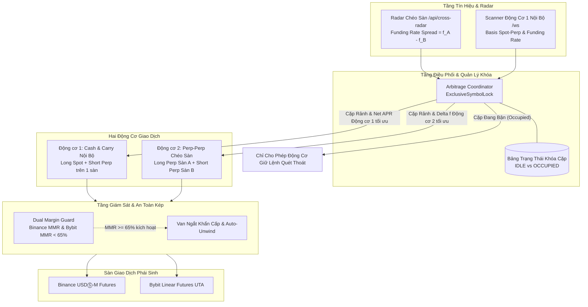
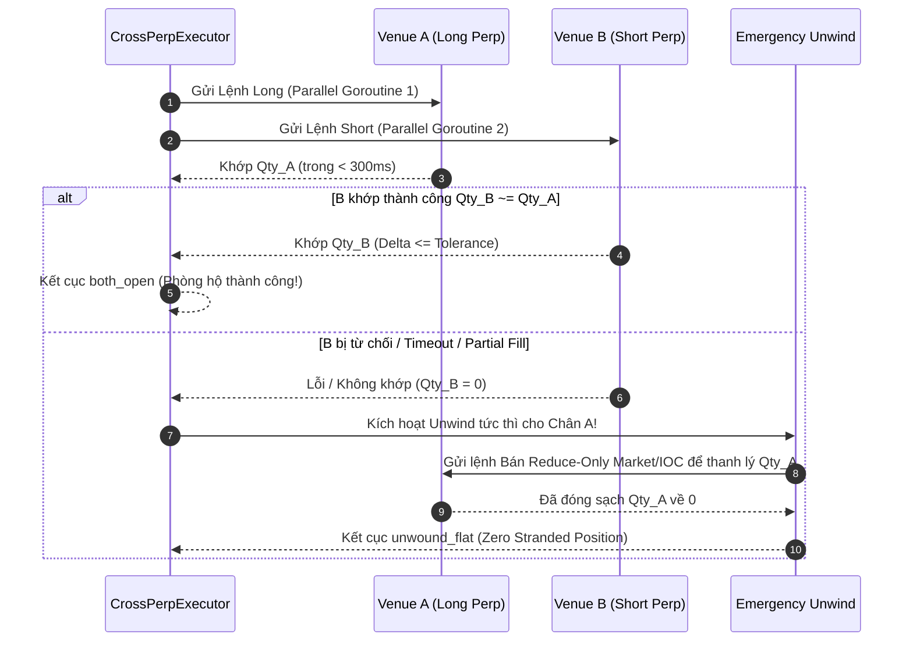

# Thiết Kế Kỹ Thuật Chi Tiết: Động Cơ 2 (Perp–Perp Chéo Sàn) & Bộ Khóa Cặp Rảnh Rỗi

> **Tài liệu:** Thiết kế kiến trúc & đặc tả kỹ thuật chi tiết cho Bước 3  
> **Áp dụng:** Binance USDⓈ-M Futures $\longleftrightarrow$ Bybit Linear Futures (V5 UTA)  
> **Nguyên tắc bất biến:** Delta-Neutral tuyệt đối, Zero-Stranded Position, Cặp Rảnh Rỗi (Exclusive Symbol Lock), và Van ngắt ký quỹ kép $65\%$.

---

## 1. TỔNG QUAN KIẾN TRÚC & PHÂN TÁCH HAI ĐỘNG CƠ

Hệ thống giao dịch tự động phân tách thành 2 động cơ độc lập, được điều phối tập trung bởi **Bộ Điều Phối Khóa Độc Quyền (Arbitrage Coordinator)**:



---

## 2. BỘ KHÓA CẶP RẢNH RỖI (EXCLUSIVE SYMBOL LOCK)

### 2.1. Vấn đề kỹ thuật trên tài khoản One-Way Mode
Cả Binance USDⓈ-M Futures và Bybit UTA phái sinh đều hoạt động ở chế độ **One-Way Mode** (một chiều). Nếu một đồng coin (ví dụ `BTCUSDT`) cùng lúc được mở lệnh bởi cả Động cơ 1 (Short Perp) và Động cơ 2 (Long Perp):
1. **Triệt tiêu vị thế:** Lệnh Long của Động cơ 2 sẽ bù trừ làm giảm hoặc triệt tiêu vị thế Short của Động cơ 1 trên cùng tài khoản.
2. **Vỡ phòng hộ Delta-Neutral:** Cả 2 động cơ đều bị hở rủi ro thị trường (Unhedged Delta exposure).
3. **Xung đột PnL & Thoát lệnh:** Khi một động cơ muốn đóng lệnh, nó sẽ gửi lệnh ngược chiều làm đảo lộn hoàn toàn vị thế của động cơ còn lại.

$\implies$ **Quy tắc bất biến:** Một `Symbol` tại bất kỳ thời điểm nào chỉ được thuộc quyền sở hữu của **tối đa một động cơ** (`OwnerEngine`).

### 2.2. Đặc tả cấu trúc dữ liệu & Interface

Vị trí: `internal/coordinator/lock.go`

```go
package coordinator

import (
	"context"
	"sync"
	"time"
)

type EngineID string

const (
	EngineCashAndCarry EngineID = "engine_1_cash_and_carry" // Spot-Perp (Single Venue)
	EngineCrossPerp    EngineID = "engine_2_cross_perp"    // Perp-Perp (Cross Venue)
)

type SymbolState string

const (
	StateIdle     SymbolState = "idle"     // Cặp rảnh: Cả 2 động cơ được phép quét tìm điểm vào
	StateOccupied SymbolState = "occupied" // Cặp bận: Đã có vị thế mở, cấm mở mới từ động cơ khác
)

type SymbolLock struct {
	Symbol       string      `json:"symbol"`
	State        SymbolState `json:"state"`
	OwnerEngine  EngineID    `json:"owner_engine,omitempty"`
	IntentID     string      `json:"intent_id,omitempty"`
	LockedAtMs   int64       `json:"locked_at_ms,omitempty"`
	Details      string      `json:"details,omitempty"`
}

type Coordinator interface {
	// TryAcquire cố gắng xin quyền mở vị thế cho symbol từ engine.
	// Trả về false nếu symbol đang bận (occupied) hoặc đang bị khóa.
	TryAcquire(symbol string, engine EngineID, intentID string, details string) bool

	// Release giải phóng lock khi vị thế đã phẳng sạch sẽ (both_flat).
	// Chỉ owner engine mới có quyền release.
	Release(symbol string, engine EngineID, intentID string) error

	// QueryLock đọc trạng thái lock hiện tại của một symbol.
	QueryLock(symbol string) (SymbolLock, bool)

	// ListLocks trả về danh sách tất cả các symbol đang bị khóa.
	ListLocks() []SymbolLock

	// ReconcileActivePositions đối soát vị thế thực tế trên sàn để tái tạo lock khi khởi động lại bot.
	ReconcileActivePositions(ctx context.Context) error
}
```

### 2.3. Quy tắc vận hành và ưu tiên (Lock Routing Rules)
1. **Cặp Rảnh (`StateIdle`):**
   - Cả 2 động cơ được phép quét tín hiệu song song.
   - Nếu xảy ra tranh chấp tín hiệu đồng thời trên cùng một symbol: Coordinator tính toán **Net APR kỳ vọng (sau trừ taker fees và trượt giá)**. Động cơ nào có Net APR cao hơn sẽ được cấp Lock mở lệnh.
2. **Cặp Bận (`StateOccupied`):**
   - Động cơ sở hữu (`OwnerEngine`) tiếp tục vòng lặp giám sát:
     - Quét chốt lời khi Basis hội tụ hoặc Spread Funding đảo chiều.
     - Quét cắt lỗ hoặc gỡ lệnh khi phát hiện rủi ro.
   - Động cơ còn lại bị **chặn tuyệt đối ngay tại cửa ngõ phân tích (Entry Gate)**, không được phép sinh ý định (Intent).
3. **Phục hồi trạng thái (Persistence & Reconcile):**
   - Lưu trạng thái ra tệp `.paper/coordinator-locks.json`.
   - Mỗi khi khởi động hoặc sau khi khôi phục mạng, gọi `ReconcileActivePositions` đọc `GetPosition` từ Binance và Bybit. Bất kỳ cặp nào có $|Qty| > 0$ lập tức được đánh dấu `StateOccupied`.

---

## 3. CỖ MÁY THỰC THI PERP–PERP CHÉO SÀN (`internal/execution/crossperp`)

### 3.1. Tính cỡ lệnh chung (Common Quantization & Sizing)
Vị trí: `internal/execution/crossperp/sizing.go`

Vì mỗi sàn phái sinh quy định bước khối lượng (`StepSizeCoin`) và giá trị lệnh tối thiểu (`MinNotionalQuote`) khác nhau, cỗ máy bắt buộc phải lượng tử hóa theo mẫu số chung:

1. **Lượng tử hoá bước coin chung:**
   $$\text{Step}_{\text{common}} = \max\left(\text{Step}_{\text{venueA}}, \text{Step}_{\text{venueB}}\right)$$
2. **Khối lượng coin đặt lệnh:**
   $$Q_{\text{coin}} = \text{broker.FloorToStep}\left(\frac{\text{TargetNotionalQuote}}{P_{\text{mid}}}, \text{Step}_{\text{common}}\right)$$
3. **Kiểm tra ngưỡng tối thiểu sàn:**
   $$Q_{\text{coin}} \times P_{\text{mid}} \ge \max\left(\text{MinNotional}_{\text{venueA}}, \text{MinNotional}_{\text{venueB}}\right)$$
   Nếu không thỏa mãn $\implies$ Từ chối trước khi gửi lệnh (`RefuseBeforePlacement`).

### 3.2. Cấu trúc Đặt Lệnh Song Song (Parallel Execution Plan)
Vị trí: `internal/execution/crossperp/executor.go`

```go
type CrossPerpLeg struct {
	Venue          broker.Broker
	Market         broker.Market // MarketFuturesUSDM
	Symbol         string
	Side           broker.Side   // SideBuy (Long) hoặc SideSell (Short)
	LimitPrice     float64       // Giá bảo vệ trần/sàn (aggressive limit)
	QtyCoin        float64
	ClientOrderID  string
}

type CrossPerpPlan struct {
	IntentID       string
	Symbol         string
	QtyCoin        float64
	ToleranceCoin  float64
	LongLeg        CrossPerpLeg
	ShortLeg       CrossPerpLeg
	MaxWindowMs    int64 // Cửa sổ tối đa giữa 2 chân (mặc định 500ms)
}

type CrossPerpOutcome struct {
	IntentID       string
	Outcome        string // "both_open", "both_flat", "unwound_flat", "failed"
	LongFilledQty  float64
	LongFilledAvg  float64
	ShortFilledQty float64
	ShortFilledAvg float64
	DeltaImbalance float64 // |LongFilledQty - ShortFilledQty|
	ErrorMessage   string
}
```

### 3.3. Quy trình Đặt Lệnh & Cơ Chế Thoát Hiểm Khẩn Cấp (Unwind Engine)



**Các bất biến sống còn khi thực thi:**
- **Không bao giờ thả rông 1 chân:** Nếu chân A khớp mà chân B fail $\implies$ lập tức bắn lệnh `ReduceOnly` thanh lý chân A về phẳng (`unwound_flat`) trong vòng $< 500\text{ ms}$.
- **Cắt gọt chân thừa (`reduceToMatch`):** Nếu chân B khớp một phần $Q_B < Q_A$ $\implies$ gửi lệnh đóng bớt phần dư $(Q_A - Q_B)$ trên sàn A để delta luôn $\le \text{ToleranceCoin}$.

---

## 4. VAN AN TOÀN KÉP: GIÁM SÁT KÝ QUỸ (DUAL MARGIN GUARD)

### 4.1. Bản chất rủi ro ký quỹ phái sinh chéo sàn
Khác với Động cơ 1 (Spot mua bằng vốn thực không chịu rủi ro thanh lý), Động cơ 2 sử dụng đòn bẩy ở cả 2 sàn phái sinh ($2\text{x} - 3\text{x}$).
- Khi thị trường biến động mạnh theo 1 hướng (ví dụ BTC tăng từ $60\text{k} \to 80\text{k}$):
  - Chân Long sinh lãi lớn, nhưng **chân Short bị lỗ vị thế và rút cạn ký quỹ duy trì (Maintenance Margin)**.
  - Dù tổng danh mục Delta-Neutral vẫn có lãi hoặc hòa vốn, nếu sàn của chân Short chạm ngưỡng thanh lý cưỡng bức $\implies$ **Bị sàn ép thanh lý, mất phí phạt thanh lý và danh mục lập tức bị hở một chân Long!**

### 4.2. Đặc tả chỉ số ký quỹ của từng sàn
Vị trí: `internal/risk/margin_guard.go`

1. **Binance Futures:**
   $$\text{MMR}_{\text{binance}} = \frac{\text{totalMaintMargin}}{\text{totalMarginBalance}}$$
   (Đọc từ `/fapi/v3/account` endpoint).
2. **Bybit UTA:**
   $$\text{MMR}_{\text{bybit}} = \text{accountMMRateFrac}$$
   (Đọc từ `/v5/account/wallet-balance` endpoint, trường `accountMMRate`).

### 4.3. Cơ chế ngắt 3 cấp độ (Triple-Stage Circuit Breaker)

| Cấp độ | Ngưỡng MMR | Hành động của Hệ Thống |
| :--- | :--- | :--- |
| **Mức 1: Cảnh báo Vàng** | $\text{MMR} \ge 50\%$ | Gửi cảnh báo hệ thống (Warning). **Khóa chiều mở mới** cho Động cơ 2 trên sàn đó. Chỉ cho phép đóng vị thế. |
| **Mức 2: Cảnh báo Cam** | $\text{MMR} \ge 60\%$ | Khóa mở mới trên **toàn bộ hệ thống**. Rút ngắn chu kỳ quét chốt lời/thoát lệnh từ 1 phút xuống 5 giây. |
| **Mức 3: Ngắt Đỏ Khẩn Cấp** | $\text{MMR} \ge 65\%$ | **Kích hoạt Ngắt Khẩn Cấp (Emergency Liquidation Avoidance):**<br/>1. Dừng khẩn cấp mọi tiến trình mở lệnh.<br/>2. Tự động đóng đồng thời cả 2 chân của cặp Perp-Perp có đòn bẩy cao nhất / drawdown lớn nhất.<br/>3. Ưu tiên gửi lệnh đóng sang sàn có MMR cao hơn trước để hạ tỷ lệ ký quỹ về an toàn $(< 50\%)$.<br/>4. Phát chuông cảnh báo đỏ trên portal UI. |

---

## 5. BỘ CHỈ TIÊU KIỂM THỬ & NGHIỆM THU (VERIFICATION CRITERIA)

1. **Kiểm thử Đơn vị & Tích hợp (Unit & Integration Tests):**
   - `internal/coordinator`: Test tranh chấp 2 động cơ cùng lúc xin lock cặp BTCUSDT $\to$ 1 pass, 1 reject. Test `ReconcileActivePositions` khôi phục đúng lock khi sàn có vị thế.
   - `internal/execution/crossperp`: Test kịch bản 2 chân khớp chuẩn $\to$ `both_open`. Test kịch bản 1 chân rớt mạng $\to$ Unwind tức thì về `unwound_flat`.
   - `internal/risk`: Test mock MMR Binance $66\%$ hoặc Bybit $67\% \to$ kích hoạt đóng khẩn cấp, từ chối mở mới 100%.
2. **Không vi phạm luồng đang chạy:**
   - Toàn bộ ports 8085 (scanner), 8086 (paperledger), 8087 (execportal live Binance 8 positions) **giữ nguyên vẹn 100%**.
   - Chạy trên port phụ 8088 hoặc mock sandbox.
3. **Duy trì tiêu chuẩn mã nguồn:**
   - Toàn bộ 38/38 Go package tests chạy với `go test -count=1 -race ./...` phải **PASS 100%** (0 data races).
   - Không còn lỗi ép kiểu float mantissa (chuẩn hóa `FormatFloat` `-1`).
